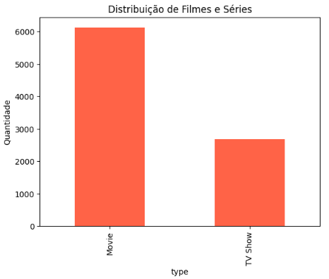
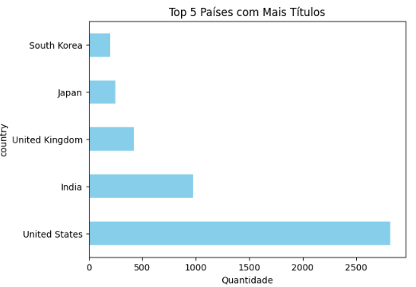
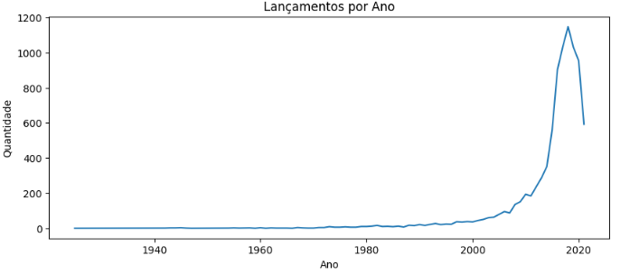

## 🎬 Análise Exploratória da Netflix com Python e Pandas

## 📌 Descrição

Este projeto foi desenvolvido como parte do meu aprendizado em Análise de Dados.  
Utilizei Python, Pandas e Matplotlib para explorar uma base de dados da Netflix, obtida no Kaggle, com o objetivo de extrair informações relevantes sobre os filmes e séries disponíveis na plataforma.

## 🧠 Objetivos do Projeto

- Praticar a leitura e análise de arquivos CSV com Pandas.  
- Gerar gráficos simples com Matplotlib.  
- Treinar perguntas e respostas sobre dados reais.  
- Construir meu primeiro projeto de portfólio no GitHub.

## 🗂️ Base de Dados

- **Fonte:** Kaggle  
- **Nome:** Netflix Movies and TV Shows  
- **Link:** [Clique aqui para acessar a base](https://www.kaggle.com/datasets/shivamb/netflix-shows)  
- **Formato:** CSV

## 🛠️ Tecnologias Utilizadas

- Python 3  
- Google Colab  
- Pandas  
- Matplotlib  
- Git e GitHub

## 📈 Análises Realizadas

**Link** [Clique aqui para acessar a base] (https://colab.research.google.com/drive/1NKEqjpPhLwtKVid-FMsDkgVV--mK3zzh#scrollTo=SbSpM5ujjPL0) 

- Quantidade total de títulos (filmes + séries)  
- Comparação entre filmes e séries disponíveis  
- Países com mais títulos na plataforma  
- Distribuição de lançamentos por ano

## 📸 Exemplos de Gráficos

  
  

## ✅ Conclusões

Este projeto foi meu primeiro passo na prática com Análise de Dados.  
Aprendi a explorar uma base real, gerar visualizações básicas e responder perguntas simples com Python.  
É o início da minha jornada como futura analista de dados.

## 🔗 Referências

- [Curso de Python para Dados - Hashtag / DSA]  
- [Documentação do Pandas](https://pandas.pydata.org/)  
- [Documentação do Matplotlib](https://matplotlib.org/)
- [Projeto inspirado neste portfólio](https://github.com/HenriqueWF/Portfolio)

